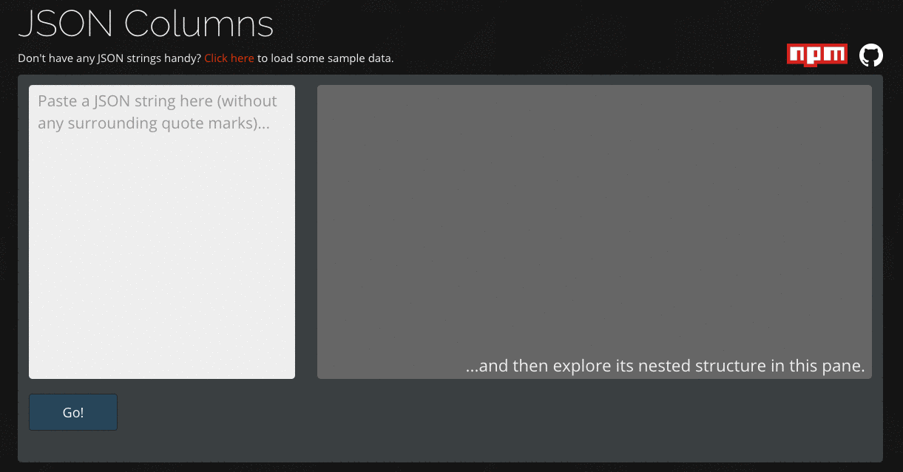

# JSON Columns

Navigate JSON-encoded data in a simple column-based interface, either to gain a general sense of the data structure or to find the path needed to reference a specific value. 

## Usage

### On the Web

The simplest way to use this tool is to copy some JSON to your clipboard and visit [json-columns.com](http://json-columns.com).

### From the Command Line

The command-line tool generates a local JSON Columns page pre-loaded with data.

Install:

`npm install -g json-columns`

To use, pass the app the path of a JSON-encoded file:

`json-columns data.json`

Alternatively, pipe it JSON data directly via standard input. For example:

`curl -# https://jsonplaceholder.typicode.com/posts | json-columns`

## License

MIT License

Copyright (c) 2017 Ryland Bell

Permission is hereby granted, free of charge, to any person obtaining a copy
of this software and associated documentation files (the "Software"), to deal
in the Software without restriction, including without limitation the rights
to use, copy, modify, merge, publish, distribute, sublicense, and/or sell
copies of the Software, and to permit persons to whom the Software is
furnished to do so, subject to the following conditions:

The above copyright notice and this permission notice shall be included in all
copies or substantial portions of the Software.

THE SOFTWARE IS PROVIDED "AS IS", WITHOUT WARRANTY OF ANY KIND, EXPRESS OR
IMPLIED, INCLUDING BUT NOT LIMITED TO THE WARRANTIES OF MERCHANTABILITY,
FITNESS FOR A PARTICULAR PURPOSE AND NONINFRINGEMENT. IN NO EVENT SHALL THE
AUTHORS OR COPYRIGHT HOLDERS BE LIABLE FOR ANY CLAIM, DAMAGES OR OTHER
LIABILITY, WHETHER IN AN ACTION OF CONTRACT, TORT OR OTHERWISE, ARISING FROM,
OUT OF OR IN CONNECTION WITH THE SOFTWARE OR THE USE OR OTHER DEALINGS IN THE
SOFTWARE.